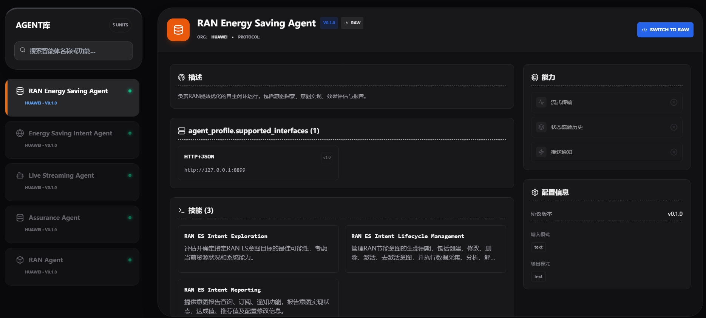
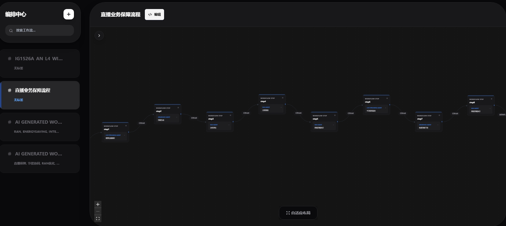
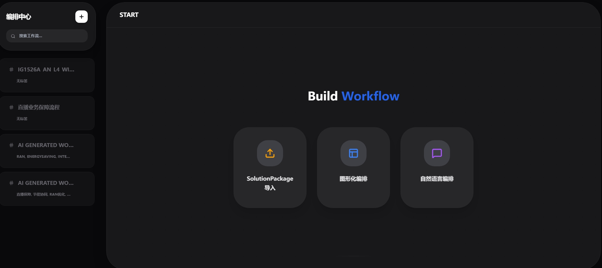
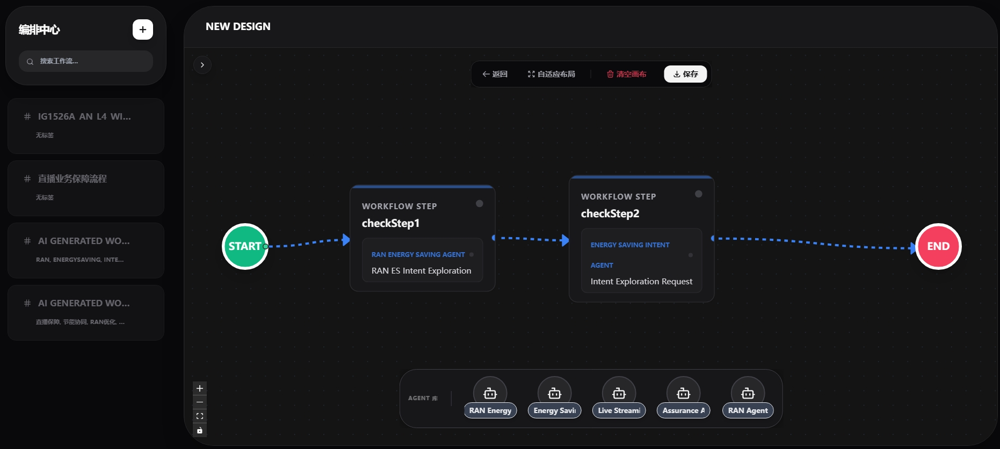
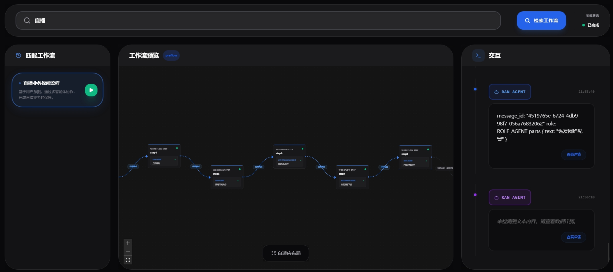

# 编排中心前端UI用户指南

## 前提条件
1. 启动注册中心服务：UI界面展示的所有Agent信息均是从注册中心获取的（具体操作见注册中心的用户指南或快速入门）
2. 启动编排中心服务： 编排中心前端UI与编排中心后台有交互，所以也需要启动（具体操作见编排中心的快速入门）
### 环境要求
- Node.js 20.19

## 启动方式
### 方式一：
进入{安装目录}/workflow-designer目录下，执行`npm install --force`命令
等待所有依赖下载完成，执行`npm run dev`

如果想查看demo，需要额外启动samples目录下的`start_agents_server.py`脚本(注册中心默认没有注册Agent，该脚本时向注册中心注册了几个Agent并启动对应的Agent)
进入到项目{安装目录}，执行命令
```bash
python -m samples.start_agents_server
```
如果是linux环境，建议给执行命令前加上 `nohup`，作用是在用户退出登录或关闭终端后继续运行，命令如下：
```bash
nohup python -m samples.start_agents_server > samples.log 2>&1 &
```
### 方式二：
进入项目目录下的`bin`文件夹
```bash
cd {安装目录}/orchestration-center/bin
``` 
执行脚本文件（该脚本文件会自动启动前端服务和samples下的脚本）：
```bash
./start_samples.sh
```
### 访问应用
上述步骤启动成功后，可以通过下面的方式进行访问。
1. 打开浏览器访问 http://localhost:3003
2. 使用工作流设计器创建和编辑流程图
3. 通过API接口管理PSOP工作流

## 界面功能介绍
配置步骤：进入编排中心 → 点击右上角齿轮图标 → 修改IP为实际环境IP → 修改端口为实际监听端口 → 保存即可。


### Agent库：

左侧区域展示全部Agent列表，支持按Agent名称或功能关键词进行搜索筛选；点击任意Agent后，右侧区域将展示该Agent的详细信息。



### 编排中心：

在左侧面板展示所有的PSOP，并通过上方的搜索框按名称快速查找。点击任一PSOP后，右侧区域将自动显示其详细信息。



如需创建新的PSOP，请单击左侧上方的“+”按钮，右侧区域将展示可用的编排方式，目前支持以下三种：



第一种：导入pdf格式文件生成对应的psop

第二种：手动编排

操作步骤如下：
- 从下方区域将 Agent 卡片拖拽至画布；
- 在画布上对 Agent 卡片进行连线；
- 点击目标连线，即可设置相应的跳转条件。
- 设置完成后，点击上方的"保存"按钮即可。
- 

第三种：用户输入自然语言后，后台将自动解析用户意图，并结合当前所有可用Agent进行智能编排生成PSOP。

### 工作流执行
操作步骤如下：
- 在上方输入框中输入用户意图；
- 点击右侧的“检索工作流”按钮；
- 系统检索到对应PSOP后，左侧区域将显示该PSOP；
- 中间区域自动展示该PSOP对应的工作流；
- 点击左侧PSOP右侧的“▶”按钮，页面右侧将实时显示工作流的执行过程。
- 



